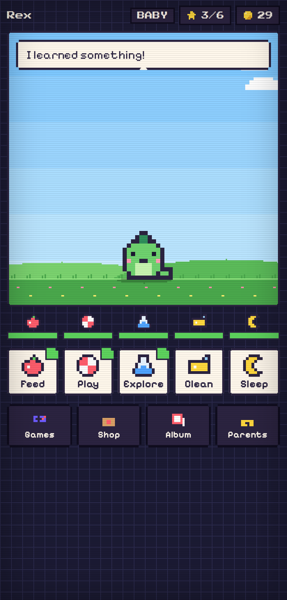
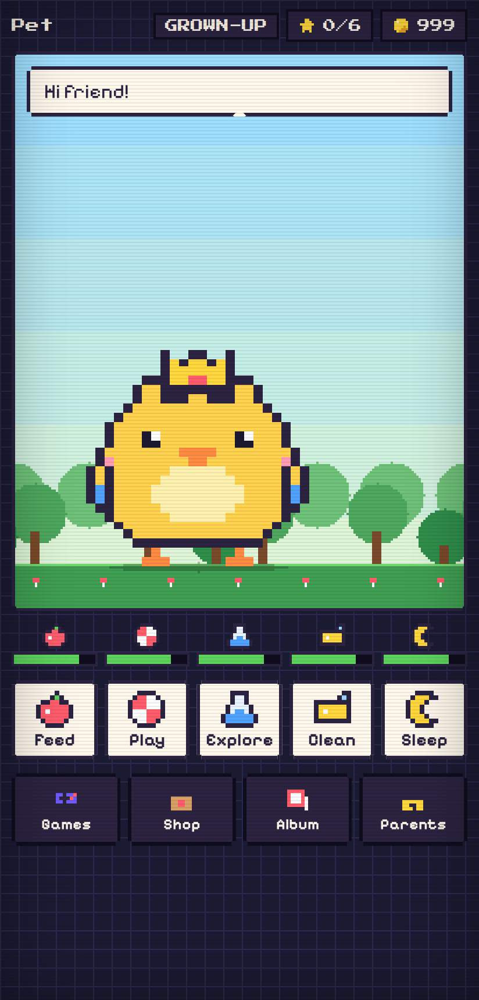
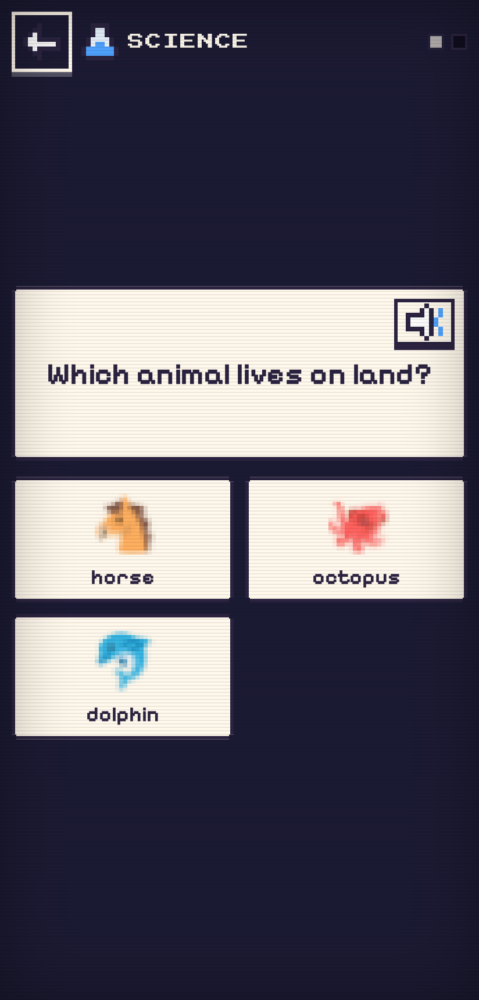
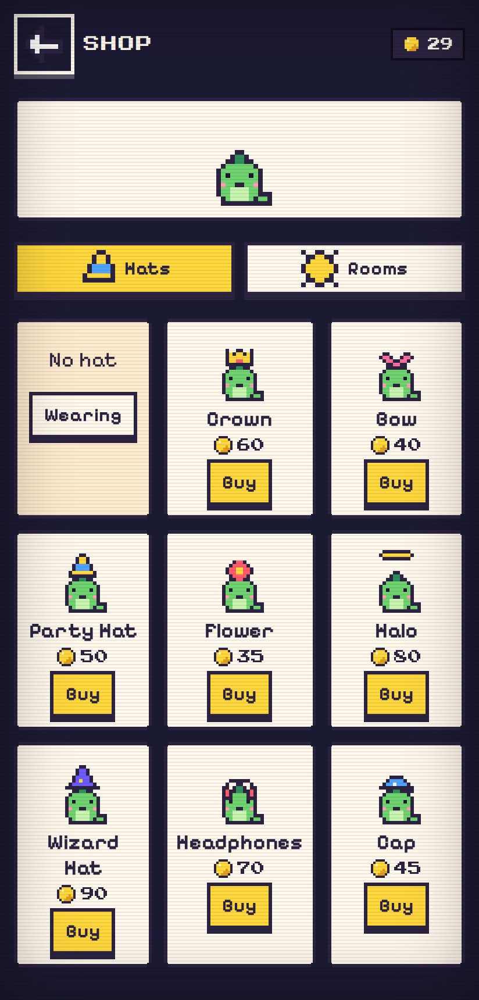

# Pixel Pals

A retro pixel-art virtual pet, in the spirit of Tamagotchi, that grows only when
its owner practises **English, maths and science**. Built for a 6-year-old on an
Android tablet or phone, but it runs in any modern browser.

   

- 100% free and open source (MIT). No ads, no tracking.
- Zero dependencies and no build step: plain HTML, CSS and JavaScript.
- Installable as a web app (PWA). Works offline once installed.
- All art is hand-drawn pixel data in the code; sounds are synthesised on the fly.
- Two ways to run: **local** (progress stays on the device, no accounts) or
  **cloud** (progress saved in your own AWS account behind Google sign-in, play
  on any device, one device at a time per player). See [docs/cloud.md](docs/cloud.md).

## How the game works

### Caring = learning

Every care action opens a short learning round (2 or 3 questions). Finishing it
feeds, entertains, teaches or cleans the pet.

| Button  | Need   | Subject                                                        |
|---------|--------|----------------------------------------------------------------|
| Feed    | Tummy  | Maths: counting, number recognition, shapes, + and -, sequences, doubles, groups, word problems |
| Play    | Fun    | English: letters, letter sounds, reading words with pictures, rhymes, sight words, sentences, spelling with letter tiles, opposites, plurals |
| Explore | Brain  | Science: a "Did you know?" fact card with a picture, then a question about it (animals, space, body, weather, plants, everyday science), plus sorting tasks (living or not, floats or sinks, hot or cold, baby animals...) |
| Clean   | Clean  | Review: mixes recently missed questions with fresh ones from all subjects |
| Sleep   | Energy | No quiz. The pet rests in real time and wakes by itself in the morning |

Questions can be read aloud with the speaker button (text-to-speech). A wrong
answer gets a gentle "try again"; after two misses the right answer is shown.
Difficulty adapts automatically per subject (levels 1-6): four first-try
answers in a row move up a level, three misses move down. Parents can pin a
level instead.

### Growing over weeks, not an afternoon

- Each finished activity earns **1 star**, but only up to the **daily star goal**
  (default 6, parents can set 2-12). After that, activities are "practice":
  the pet is still cared for and a couple of coins drop, but no stars.
- The pet moves to the next stage only when it has **both** enough total stars
  **and** enough real days in its current stage:

| Stage    | Stars needed | Min. days in previous stage |
|----------|--------------|-----------------------------|
| Egg      | -            | hatches after the first activity |
| Baby     | 1            | -                           |
| Kid      | 15           | 2                           |
| Teen     | 45           | 5                           |
| Grown-up | 100          | 10                          |
| Legend   | 180          | 14                          |

  At 6 stars a day that is at least a month of play to reach Legend, and a
  couple of months at a relaxed pace. When a pet becomes a Legend, parents can
  move it to the Hall of Fame and start a new egg (coins, hats and levels carry
  over), so the game keeps going.
- Needs (tummy, fun, brain, clean, energy) drop slowly in real time. The pet is
  never punished harshly: stats bottom out at a "sad but fine" level, and a
  long break is capped so coming back after a holiday is not a disaster.
- Daily streaks, a small daily gift and 19 badges reward coming back.

### Always something to do

- **Mini-games** (unlimited, never count towards stars, give coins):
  Fruit Catch, Bubble Pop (pop the bubble with the number or letter asked),
  Memory Match.
- **Shop**: coins buy hats (crown, bow, party hat, wizard hat...) that the pet
  wears in the room, and new rooms (meadow, bedroom, beach, forest, space).
- The room has a day/night cycle that follows the real clock.

### Multiple players

Each child has their own profile with their own pet, coins, levels, badges and
settings. Tap the pet's name at the top of the home screen to switch player.

### Parents' corner

Behind a simple multiplication gate (grown-ups only):

- daily star goal, difficulty and auto-level per subject
- sound effects, music and read-aloud toggles
- reset the pet, delete a player, start a new egg after Legend
- export/import a save file (progress is stored on the device only)

## Play it

### Quick start on Android (or any phone/tablet)

1. Host the folder anywhere that serves static files (GitHub Pages is free, see
   below), or run it locally on the same Wi-Fi.
2. Open the URL in Chrome, then choose **Add to Home screen** (menu ⋮ → Add to
   Home screen / Install app).
3. Launch it from the home screen: it runs full screen and works offline.

### GitHub Pages

The repository includes a workflow that publishes the game on every push to
`main` (the repository must be public, or on a paid GitHub plan). The first run
enables Pages by itself. This repository's copy lives at
<https://carlos-aws.github.io/pixel-pals/>; a fork is published at
`https://<your-user>.github.io/<repo-name>/`.

### Cloud mode (any device, progress saved online)

Deploy the included AWS stack (S3 + CloudFront, Cognito with Google sign-in,
Lambda + DynamoDB) with one script:

```
cp infra/.env.example infra/.env   # Google OAuth client, allowed emails
./infra/deploy.sh
```

Full instructions, including the Google OAuth client setup and how the
one-device-at-a-time rule works, are in [docs/cloud.md](docs/cloud.md).
Try it without AWS with `npm run mock-cloud`.

### Run locally

Any static file server works. With Node installed:

```
npm start        # serves http://localhost:8080
```

or `python3 -m http.server 8080`. Open the address on your phone (same Wi-Fi)
using your computer's IP, e.g. `http://192.168.1.20:8080`.

Note: the service worker (offline mode) and text-to-speech require `https://`
or `localhost`; over a plain `http://` LAN address the game still works, just
without offline caching.

### Handy URL switches (for testing)

- `?debug=1` adds a Debug panel in the parents' corner (add stars, age the pet
  by a day, add coins, make the pet needy) so you can preview growth.
- `?time=21:30` pretends it is that time of day (night sky, auto-wake rules).
- `?profiles` opens the player list instead of the last player.

## Development

```
npm test           # unit tests (game rules, daily limits, content validity, cloud lease rules)
npm run lint       # eslint
npm run e2e        # headless browser run-throughs (local + cloud mock) with screenshots in tools/out/
npm run mock-cloud # local stand-in for the cloud backend on http://localhost:8090
npm run icons      # regenerate PWA icons from the sprite data
```

Project layout:

```
index.html, styles.css, manifest.webmanifest, sw.js
src/main.js            app state, screen router, autosave, timers
src/pet.js             pet rules: needs, mood, growth stages, daily star budget
src/storage.js         profile creation, migration, localStorage persistence, import/export
src/store.js           local vs cloud store (same interface); cloud lease handling
src/cloud/             config loader, Cognito sign-in (PKCE, no libraries), API client
src/content/           question generators (math.js, english.js, science.js) + adaptive engine
src/scene.js           canvas renderer: rooms, day/night, pet animation, particles, hatch/evolve
src/sprites.js         all pixel art (pets, hats, icons) as character maps
src/audio.js           chiptune sound effects and music (Web Audio, no files)
src/speech.js          text-to-speech helper
src/screens/           profiles, home, activity, games, shop, album, parents
src/minigames/         catch, bubbles, memory
infra/                 AWS stack (template.yaml), Lambda code, deploy.sh
tests/                 node:test unit tests
tools/                 e2e and screenshot scripts (Playwright), mock cloud server
```

### Adding content

- **Science facts**: add an entry to `FACTS` in `src/content/science.js`
  (`fact`, `q`, answer `a`, distractors `d`, an emoji and a level 1-3).
- **Words**: add to `WORDS` in `src/content/english.js` with an emoji picture;
  give it a rhyme family (`fam`) to use it in rhyming questions.
- **Sentences**: add to `SENTENCES`; the answer and distractors must be words
  from the word bank.
- **Hats and pets**: draw them as rows of characters in `src/sprites.js`.
  Each character maps to a colour in the sprite's palette; `.` is transparent.

Run `npm test`: the tests generate hundreds of questions per level and check
that every question has exactly one correct answer.

## Credits and licences

- Code: MIT (see `LICENSE`).
- Fonts: [Press Start 2P](https://fonts.google.com/specimen/Press+Start+2P) and
  [Pixelify Sans](https://fonts.google.com/specimen/Pixelify+Sans), both under
  the SIL Open Font License 1.1 (see `assets/fonts/`).
- Pictures for the vocabulary use your device's own emoji font, drawn small
  and scaled up to look pixelated.
